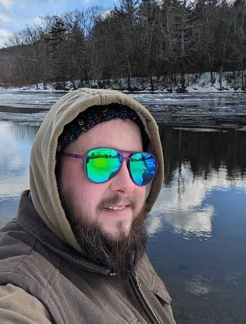
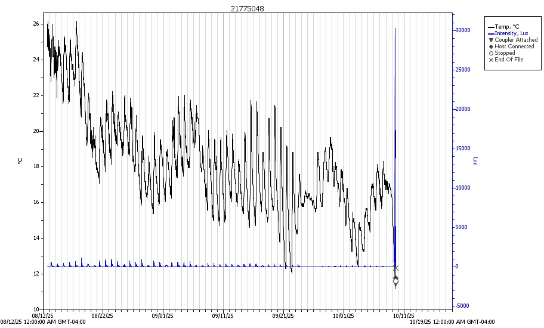
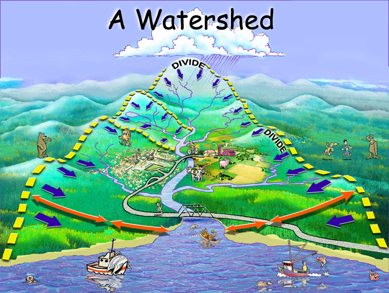

```{r setup}
### library

library(tidyverse)
library(readxl)
library(lubridate)
library(maps)
library(mapproj)
library(sf)
library(patchwork)
library(ggiraph)
library(ggtext)
library(scales)
library(htmlwidgets)
library(gt)
library(EnvStats)
library(paletteer)
library(dataRetrieval)
library(ggnewscale)
library(ggbrick)
library(htmlwidgets)

## data
setwd("C:/Users/agntm/OneDrive/Desktop/R/Portfolio/data")

# thresholds

swimming <- 235
boating <- 575

# 5 year map info
ctr_mainstem <- st_read("maps/ctr-mainstem-line.shp", quiet = TRUE) %>%
  fortify()

watershed_states <- map_data("state") %>% 
  filter(region %in% c("connecticut", "massachusetts", "vermont", "new hampshire")) %>% 
           filter(!subregion %in% c("martha's vineyard", "nantucket"))

# 5 year data

allsiteinfo <- read_xlsx("crcdata/allsiteinfo.xlsx")
allsitespivoted <- allsiteinfo %>%
  pivot_longer(cols = c("Old", "New"),
               names_to = NULL,
               values_to = "JOINID")
  
bactdata_orig <- read_xlsx("crcdata/19_23CTRMainstemData.xlsx")

bactdata_tidy <- bactdata_orig %>%
  mutate(ResultValue = case_when(
    str_detect(ResultDetection, "Above") ~ ResultLimit * 2,
    str_detect(ResultDetection, "Not") ~ ResultLimit/2,
    TRUE ~ ResultValue
  )) %>%
  left_join(., allsitespivoted, by = c("SiteID" = "JOINID")) %>%
  mutate(SiteID = SiteID.y,
         Lat = as.numeric(Lat),
         Lon = as.numeric(Lon)) %>%
  select(c("SiteID", "SampleDate", "ResultValue", "WeatherStatus", "Chart Name", "Lat", "Lon", "ResultDetection", "ResultLimit")) %>%
  filter(`Chart Name` != "Pynchon Point")

```

## Overview

-   Introduction to me
-   Water quality communication challenges
-   Case study: Creating Clearer Charts
-   Case study: Revamping Is It Clean

## Who Am I?

::::: {.columns}
::: {.column .r-fit-text width="60%"}
-   B.S. Geology (2011) & M.S. Sustainability Sciences (2013) from UMass Amherst
-   2012: Volunteered in Connecticut River Conservancy's (CRC) water quality lab testing *E. coli* samples
-   2013: Vermont Agency of Natural Resources Intern supporting Southeastern Vermont Watershed Alliance (SeVWA) and Ottauquechee River Group monitoring programs
-   2014+: Continued coordinating SeVWA program and supporting CRC lab and other various projects
-   2017: Started Deerfield River Watershed Association (DRWA) monitoring program covering both MA & VT portion of watershed
-   2018-2025: Became CRC's water quality program manager bringing together CRC's MA & CT monitoring with SeVWA and DRWA programs
:::

::: {.column width="40%"}

:::
:::::

# Water Quality Communication Challenges {background-color="black" background-image="https://live.staticflickr.com/8322/8031897271_9c63e48a29.jpg" background-opacity="0.6"}

## Why is it so hard?

:::::: {.columns}

::: {.column .r-fit-text width="40%"}
-   As scientists, we want to communicate precisely
-   Audiences have varying skill levels of interpreting data
-   Water quality data is complex and noisy
-   Data can be both overabundant and sparse
-   Water quality professionals are used to looking at this stuff!
:::

:::: {.column width="60%"}
::: {.fragment}
{.lightbox}
:::
::::

::::::

::: {.notes}
- As scientists, we want to communicate accurately and precisely 
  - We don't want to be misinterpreted so we attempt to communicate as precisely as we understand the data 
  - I ran into this issue a lot when sending copy to communications, they would attempt to simplify the language to make it easier to understand and drastically change the meaning of what I was trying to say 
  - It's a difficult balance to avoid jargon while maintaining clear meanings

- Audiences have varying skill levels of interpreting data  - We are trying to communicate to people from a variety of backgrounds and experiences 
  - Some people want simple information (ok but, can I swim in it?) and others want to see all the numbers and make their own conclusions 
  - Difficult to balance the needs of both ends of this spectrum 
  - I.E. data can make more sense using a logirithmic scale but most people are unfamiliar with how to read them

- Water quality data is complex and noisy 
  - There are so many external factors like land use, weather, flow, time of year, discharges like combined sewer overflows that affect the numbers 
  - Rivers are constantly flowing and so are constantly in flux but grab samples are snapshots in time * Does this spot suddenly have high bacteria because something changed or because a goose flew by and pooped in the water right before I sampled and most of the time it's still fine? Have to wait for another sample to confirm a trend but audiences sometimes what immediate action
  
- Data can be both overabundant and sparse 
  - Continuous monitoring can produce data points in the thousands 
  - Volunteer grab sampling can be restricted by schedule, extreme weather events, and seasonality

- Water quality professionals are used to looking a this stuff! 
  - When we're in this kind of data day in and day out, what may seem simple and common knowledge to us may actually be very niche * look at this charthere 
  - some of you may know what it is immediately without being able tosee the axes and legend clearly and many of you probably do not
  
:::

## Start from the basics

 

::: {.notes} 
- My favorite diagram of a watershed 
- Explains what a watershed is clearly, demonstrates different land uses and subwatersheds 
- Has enough fun things to look at for people who might be bored relearning the basics 
- I wish I knew where it came from... 
:::

# Case Study: Creating Clearer Charts

## The Problem {.smaller}

-   How do we present five years of *E. coli* data clearly?
-   Samples collected by volunteers over five years in three states
-   CT & MA sampled on different days of the week, VT sampled every other week
-   Weather conditions may be different across such a large area
-   Include in a report for colleagues, volunteers, and the public to review on their own

{.r-stretch}

::: {.notes}
- Through Is It clean (to be discussed later), results from CRC monitoring are available as soon as possible so reports could focus on long-term trends
- I wanted to aggregate results from a very wide geographic area but
- sites were not all sampled simultaneously
- Even if they had been sampled all that same time, weather can be different 
- 
:::

## The Data {transition="fade-out"}

::::: {.columns}
::: {.column .r-fit-text width="30%"}
-   Here is just one year of data
-   What results are good? Bad?
-   Where are the sites?
:::

::: {.column width="70%"}
```{r 23 basic graph}
basic2023 <- ggplot(filter(bactdata_tidy, year(SampleDate)==2023), aes(x = SampleDate, y = ResultValue, color = SiteID)) +
  geom_point(aes(shape = WeatherStatus)) +
  geom_line() +
  labs(
    title = "2023 Connecticut River Data",
    x = "Sample Date",
    y = "E. coli (MPN/100mL)",
    color = "Site ID",
    shape = "Weather"
  )

basic2023
```
:::
:::::

::: {.notes}
- I put this on a line chart but it would be just as overwhelming on a bar chart
- Compared to the range of the test, "good results" and "bad results" are right next to each other
- CRC's site ids provide a lot of information (site, river, and river mile) but it looks like gibberish to most people
- There are some conclusions that can be made using this chart but not a lot
- zoom in
:::

## The Data {transition="fade"}

```{r print 23 basic graph}
basic2023
```

## The Data {.smaller transition="fade-in"}

Adding more data doesn't make it better...

```{r all years}
ggplot(bactdata_tidy, aes(x = SampleDate, y = ResultValue, color = SiteID)) +
  geom_point(aes(shape = WeatherStatus)) +
  geom_line() +
  facet_wrap(~year(SampleDate), scales="free_x")+
  labs(
    title = "2019-2023 Connecticut River Data",
    x = "Sample Date",
    y = "E. coli (MPN/100mL)",
    color = "Site ID",
    shape = "Weather"
  )
```

## Telling a story with data {.smaller}

-   Important information:
    -   Bacteria levels are different in wet and dry weather
    -   Where each site is located relative to each other
    -   Some colloquial information about sites
    -   What are the standards, when/where are they being met, and what
        does that mean for the river user?
-   Tools
    -   Clear, familiar color coding systems
    -   Thresholds clearly marked on graph
    -   Pair a simplified map with a graph of the results
    -   Bonus: Interactivity!

## My Favorite Graph {.smaller}

```{r flagship graph}

bact_gms <- bactdata_tidy %>%
  group_by(SiteID, WeatherStatus, `Chart Name`, Lat, Lon) %>%
  summarise("GeoMean" = exp(mean(log(ResultValue)))) 

bact_gms_map <- bact_gms %>%
  pivot_wider(names_from = WeatherStatus, values_from = GeoMean)

gm_map <- ggplot() +
  geom_polygon(data = watershed_states, aes(x = long, y = lat, group = region), color = "gray50", linetype = "dotted", alpha=0) +
  geom_sf(data = ctr_mainstem, color = "#332288") +
  geom_point_interactive(data = bact_gms_map, aes(x = Lon, y = Lat, color = Wet, data_id = SiteID), size = 3) +
  geom_point_interactive(data = bact_gms_map, aes(x = Lon, y = Lat, color = Dry, data_id = SiteID), size = 1.5, shape = 15) +
  binned_scale(
    aesthetics = "color",
    scale_name = "stepsn",
    palette = function(x) c("#117733", "#DDCC77", "#882255"),
    breaks = c(235, 575),
    limits = c(0, 2420),
    show.limits = TRUE,
    guide = NULL
  ) +
  coord_sf(xlim = c(-72.4, -72.7), ylim = c(43, 41.45), expand = FALSE) +
  theme_void()

gm_chart <- ggplot(bact_gms, aes(x = GeoMean, y = fct_reorder(`Chart Name`, Lat), shape = WeatherStatus, fill = GeoMean)) +
  geom_point_interactive(aes(data_id = SiteID), size = 3) +
  binned_scale(
    aesthetics = "fill",
    scale_name = "stepsn",
    palette = function(x) c("#117733", "#DDCC77", "#882255"),
    breaks = c(235, 575),
    limits = c(0, 2420),
    show.limits = TRUE,
    guide = NULL
  ) +
  scale_shape_manual(name = "Weather", values = c(22, 21)) +
  geom_vline(aes(xintercept = swimming, linetype = "Swimming"), color = "#DDCC77", size = 1) +
  geom_vline(aes(xintercept = boating, linetype = "Boating"), color = "#882255", size = 1) +
  scale_linetype_manual(name = "Thresholds", values = c(2,3)) +
  labs(
    title = "Average E. coli Levels",
    subtitle = "2019-2023",
    x = "Average *E. coli* (MPN/100mL)",
    y = ""
  ) +
  theme_light(
    #base_size = 18
    ) +
  theme(title = ggtext::element_markdown(),
        axis.title.x = ggtext::element_markdown())

girafe(ggobj = gm_map + gm_chart, 
       height_svg = 5.5
       ) %>%
  girafe_options(opts_hover(css = "fill:#88CCEE;"))

```

See the rest of the
[report](https://reports.isitclean.us/posts/mainstem2023.html).

::: {.notes}
-   stoplight colors (also colorblind friendly!)
-   The simplified line of the CT River gives someone more familiar with the geography more information without inhibiting those who don't
-   Clear demarkation of the standards for primary and secondary contact recreation simplified to swimming/boating for the layperson that also explains the color coding without adding too much information to the legend
-   Use short common names for sites instead of Site IDs
-   Even when I don't have a map, I try to always order sites by upriver to downriver if possible
-   If I feel a particular method of displaying the data doesn't convey the full picture easily, I present multiple formats (ie line graphs of averages AND box and whisker plots of all results)
:::

# Case Study: Revamping Is It Clean

## Is It Clean?

-   Website launched in 2012
-   Part of a partnership with the Pioneer Valley Planning Commission
-   Showcase *E. coli* data being collected throughout the Connecticut
    River Watershed
-   Bilingual
-   Had a side-mission of serving as CRC's lab's water quality database
-   Built in Drupal with lots of custom code

::: {.notes}
- The website was in its final stages of development and had newly gone live when I was a lab volunteer in 2012
- PVPC website was supposed to showcase recreation throughout the Connecticut River valley and Is It Clean was one part of the site
- Initial contributers included CRC, PVPC, SeVWA, Millers River Watershed Council, and Farmington River Watershed Association
- Planned to be available in English and Spanish from the start
- CRC lacked a water quality database so the thinking was for this website to also serve that role
- Was somewhat high-tech at its development using Drupal but had a lot of custom code because there weren't abundant geographic data tools available yet
:::


## Through the ages {.smaller}

::::: {.columns}
::: {.column width="35%"}
-   In the beginning
    -   2013 [Home
        Page](https://web.archive.org/web/20130827191229/http://connecticutriver.us/site/content/sites-list)
    -   2016 [Site
        Page](https://web.archive.org/web/20170411142517/http://connecticutriver.us/site/node/14)
-   Rebranding and Incremental Change
    -   2022 [Home
        Page](https://web.archive.org/web/20221006115024/https://connecticutriver.us/site/content/sites-list)
    -   2023 [Site
        Page](https://web.archive.org/web/20230328053012/https://connecticutriver.us/barton-cove)

:::

::: {.column width="65%"}
-   Challenges along the way
    -   Funding for ongoing maintenance and updates
    -   Web developers didn't understand water quality
        -   Lat/Long was backward the ENTIRE time even though we constantly asked for it to be fixed
    -   Switched web developers and they didn't understand website and couldn't make any changes

:::

:::::

::: {.notes}
- Challenges
  - Funding disappeared after the initial development so the rest of the website was never finished and further Is It Clean development was sparse
  - We had a hard time communicating with our web developers what we wanted and how we wanted it presented
  - Then when we switched web developers, the new firm didn't understand all the custom code and couldn't make updates to the site
:::

## From the ground up {.smaller}

- Worked with [The Commons](https://www.ourcommoncode.org)
- Identified available tools that would work for CRC goals
  - Moved all CRC water quality data out of Excel into AirTable
  - Separated Is It Clean partner data out of CRC data
  - Developed ideal vision for the new website and created RFP
- [Fedo.Studio](https://www.fedo.studio) developed Is It Clean
  - Weekly meetings from wireframes through to custom code development
  - Took the time to understand water quality data and what we wanted to communicate

::: {.aside}
Read The Commons' case study of the Is It Clean Development [here](https://www.ourcommoncode.org/digital-service-case-studies/is-it-clean)
:::

## Meet the new website {.r-fit-text}

[Is It Clean](https://www.isitclean.us)


# Questions?
